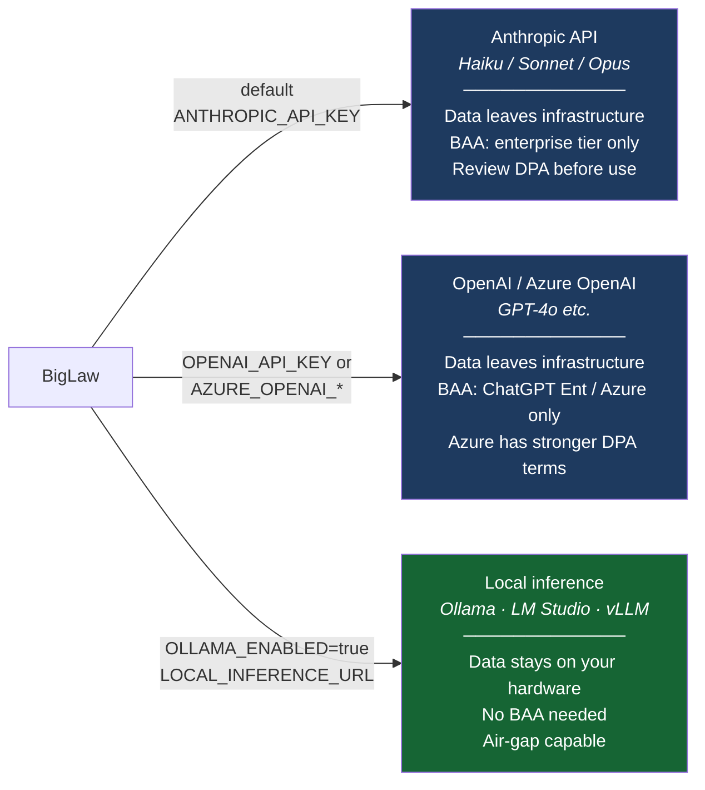
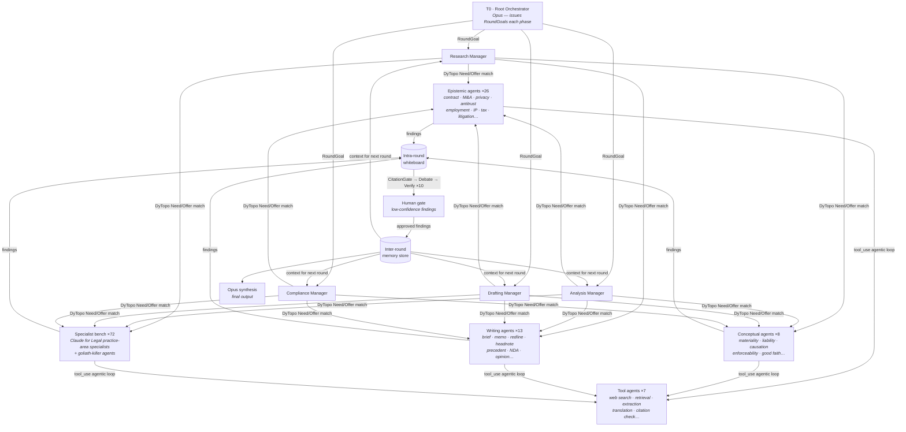
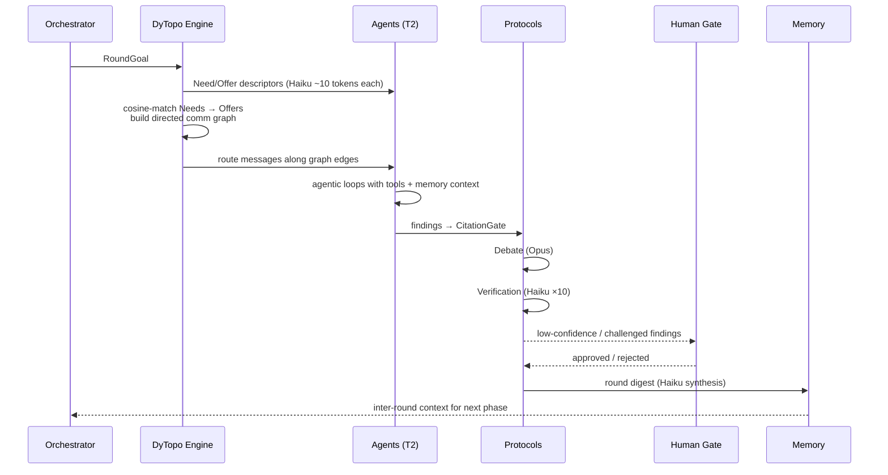
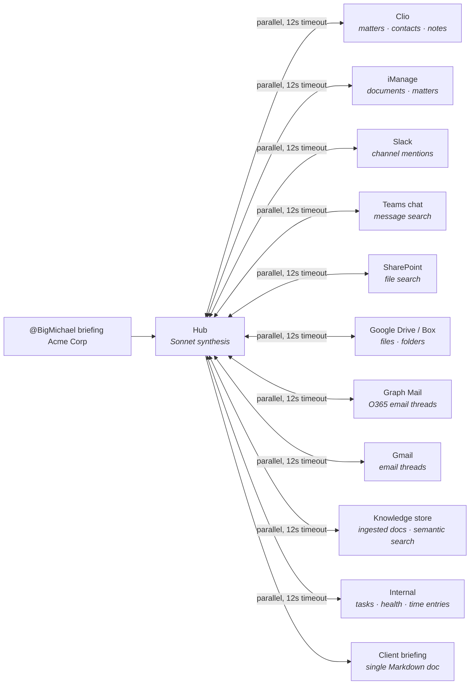

<div align="center">

# BigLaw

### The BigLaw tool stack. Open. Free.

**What Am Law 100 firms spend $2M/year on — consolidated into one open-source platform, free for solos, boutiques, and small firms.**

[](LICENSE)
[](biglaw-go/go.mod)
[](#using-from-claude-code)
[](biglaw-go/internal/agents/registry.go)
[](#-experimental--security-notice)

**The platform is a single static Go binary** — it runs end-to-end on a Raspberry Pi with
4 GB of RAM, or entirely on local models (Ollama / LM Studio). Benchmarks vs the original
TypeScript implementation: 1.25×–6.9× ([methodology](docs/benchmarks-go-vs-ts.md)). The code
lives in [`biglaw-go/internal/`](biglaw-go/internal/); the TypeScript original is preserved
at the tag `typescript-final`.

</div>

---

## ⚠ Experimental — Security Notice

**BigLaw is an experimental research project. It is not production-hardened software.**

The goal of this project is to build the **most comprehensive open legal AI platform possible** — covering the widest breadth of legal workflows, integrations, agent types, and jurisdictions. Comprehensiveness of capability is the primary objective. Test coverage and security hardening, while taken seriously and continuously improved, are secondary to that goal.

**What this means in practice:**

- The platform handles credentials, client matter data, and privileged legal communications. Firms deploying it are responsible for their own threat model.
- The codebase receives ongoing security sweeps and bug fixes, but has **not undergone a formal independent security audit**.
- **Before deploying in any environment where real client data is involved, you must engage an independent security professional (pen tester, security engineer, or FDE — Forward Deployed Engineer / Formal Deployment Expert) to review the deployment configuration and code.**
- `AUTH_ENABLED=false` is the default for local development. **Never expose the API on a public or shared network without enabling authentication.**
- API keys, session secrets, and OAuth credentials must be treated as production secrets regardless of environment.

**Independent security review is not optional for production deployments. It is a prerequisite.**

This notice does not diminish what BigLaw is — it is the most capable open legal AI stack available. It does mean you should not deploy it like a SaaS product without the due diligence that any complex, credential-holding, client-data-processing system requires.

---

## What BigLaw Is

BigLaw is a cross between a **platform**, an **experiment**, and an **art project**.

As a platform, it is the most comprehensive open legal AI stack that exists — spanning research,
drafting, redlining, e-signatures, briefing, docketing, billing, and collaboration across a bench
of 100+ agents in a structured multi-round debate architecture.

As an experiment, it is an ongoing attempt to answer a genuine engineering question: how much of
the $50,000–150,000 per-lawyer-per-year legal tech stack can be replicated with open models, open
protocols, and open code? The answer so far is: most of it.

As an art project, it is a provocation. The cost chart below is not a sales pitch. It is a
statement about who gets access to tools and who doesn't, and what happens when that changes.
It is deliberately maximalist, deliberately opinionated, and deliberately not finished.

You are not buying a product. You are picking up a thing that is still being built and deciding
what to do with it.

---

## Legal Notices and Disclaimers

*Read these. They are not boilerplate. They describe real risks that apply to you.*

### No Legal Advice

**BigLaw does not provide legal advice. Nothing produced by this software — no output, finding,
draft, analysis, summary, headnote, redline, briefing, or synthesis — constitutes legal advice,
and none of it should be relied upon as such.**

BigLaw is a software tool that uses large language models to assist with legal research and
document tasks. LLMs hallucinate. They misstate case holdings. They miss recent developments.
They confuse jurisdictions. They produce authoritative-sounding text that is factually wrong.
The debate and verification protocols in this system reduce these errors but do not eliminate them.

**Every output of this system requires review by a licensed attorney before it is used in any
legal matter.** Relying on unreviewed AI output in client matters may constitute malpractice,
regardless of how capable the underlying system appears.

If you are not a licensed attorney and you are using this software to answer legal questions
about your own situation: please consult a lawyer. This software is not a substitute.

### No Attorney-Client Relationship

Use of BigLaw does not create an attorney-client relationship of any kind — between you and
Discover Legal, between you and any contributor to this project, or between you and any AI
system operated through this software.

> # ⚠ PRIVILEGE IS NOT GUARANTEED
>
> **Whether communications, outputs, or data processed through this system attract
> legal professional privilege (attorney-client privilege, legal advice privilege,
> litigation privilege, or equivalent) depends entirely on your jurisdiction, the
> specific facts of your deployment, how the system is configured, who has access
> to it, and how outputs are used.**
>
> **Do not assume privilege applies. It may not.**
>
> To structure a deployment that maximises privilege protection for your jurisdiction
> — including network isolation, access controls, data residency, and workflow design —
> **engage an independent FDE (Forward Deployed Engineer / Formal Deployment Expert) before handling any privileged matter.**

### Unauthorised Practice of Law

Depending on your jurisdiction, using AI tools to perform certain legal tasks — drafting court
documents, providing legal advice to third parties, representing parties in legal proceedings —
may constitute the unauthorised practice of law if performed by a non-attorney. The fact that
the work is AI-assisted does not change this analysis. Know your jurisdiction's rules.

If you are a law firm deploying BigLaw, you remain responsible for supervising all AI-assisted
work product under your professional responsibility obligations, including the duty of competence
(understanding the technology), the duty of confidentiality (securing client data), and the duty
of supervision (reviewing outputs before they leave the firm).

### Confidentiality and Data Security

**BigLaw processes whatever data you give it.** If you feed it client communications, privileged
documents, personally identifiable information, health records, financial data, or anything else
that is sensitive or regulated, that data will flow through your configured model provider and
may be stored locally. Where that data goes depends entirely on how you have deployed the system.

**BigLaw supports multiple inference backends — the data handling implications differ for each:**



- **Anthropic API (default)** — data is sent to Anthropic's servers subject to their data
  processing terms and usage policies. Review these before using with client data.
- **OpenAI / Azure OpenAI** — data is sent to OpenAI or Microsoft's servers subject to their
  respective terms. Azure OpenAI offers enterprise data handling commitments that the standard
  OpenAI API does not.
- **Ollama / LM Studio / local inference** (`OLLAMA_ENABLED=true` or `LOCAL_INFERENCE_URL`) —
  data never leaves your infrastructure. For air-gapped or maximally confidential deployments,
  local inference is the only option that gives you complete data control.

**Regardless of backend, data may also be:**
- Stored in the local vector database (persists to disk at `./data/`)
- Written to the audit log (JSONL, also on disk)
- Included in prompts that are cached by a cloud API provider

**Regulatory obligations depend on your jurisdiction and the nature of the data:**

- **HIPAA (US)** — if you process protected health information, you need a Business Associate
  Agreement (BAA) with your model provider. Anthropic offers BAAs on certain enterprise tiers
  only. OpenAI offers BAAs on ChatGPT Enterprise and Azure OpenAI. Standard API tiers typically
  do not include BAA coverage. If you cannot get a BAA, use local inference.
- **GDPR (EU/EEA)** — processing personal data of EU residents requires a lawful basis and,
  for cloud providers, appropriate Standard Contractual Clauses or equivalent transfer mechanisms.
  Data residency matters. Check where your provider processes and stores data.
- **CCPA / US state privacy laws** — obligations vary by state and the nature of the data.
- **Bar association ethics rules** — most jurisdictions now have guidance on cloud-based legal
  technology. Many require a reasonable investigation of the provider's security and privacy
  practices before using the service with client data.

**The bottom line: your data handling obligations depend on your jurisdiction, your client base,
the sensitivity of the data, and which inference backend you use. There is no universal answer.
Engage qualified legal counsel and an independent FDE to map your specific obligations before
deploying with real client data.**

### Deployment Liability

**You deploy this software at your own risk.** Discover Legal and the contributors to this
project provide it under the AGPL-3.0 licence, which explicitly disclaims all warranties,
including fitness for a particular purpose and non-infringement.

Specific risks that arise from misconfigured or insecure deployment include:

- **Client data breach.** If the API is exposed without authentication (`AUTH_ENABLED=false`
  on a network-accessible host), any client matter data ingested into the system is potentially
  accessible to anyone who can reach the endpoint. This would constitute a data breach under
  most applicable law and a serious professional responsibility violation.
- **Credential exposure.** API keys, OAuth tokens, and session secrets stored in `.env` files
  or accessible via a misconfigured server can be extracted and used to incur costs, access
  third-party systems, or impersonate your firm.
- **Prompt injection.** Malicious content in documents you ingest or queries you run through
  the system could potentially manipulate agent outputs. The system includes defences against
  this but they are not complete.
- **Malpractice exposure.** Using AI-generated output without adequate review in a client matter
  creates professional liability risk. This risk is yours, not ours.
- **Regulatory exposure.** Depending on your jurisdiction and practice area, use of AI tools
  in legal matters may trigger disclosure obligations to clients, adverse parties, or courts.
  Some courts require disclosure of AI use in filings. Check your local rules.

### Jurisdiction

This software is designed to support legal work across multiple jurisdictions. It is not
certified, approved, or validated for use in any jurisdiction. The agents, workflows, and
outputs are not a substitute for jurisdiction-specific legal expertise.

### Third-Party Services

BigLaw integrates with numerous third-party services — Anthropic, Microsoft Graph, Google
Workspace, Slack, Clio, CourtListener, Westlaw, Everlaw, Ironclad, DocuSign, and others.
Your use of those services through this software is governed by their own terms. BigLaw is
not affiliated with, endorsed by, or a certified partner of any of these services.

### Summary

You are using experimental software in one of the highest-stakes professional contexts that
exists. The software is capable and the engineering is serious. It is also unaudited,
incompletely tested, and built for comprehensiveness first. Use it with appropriate scepticism,
appropriate oversight, and appropriate professional responsibility.

---

BigLaw isn't a chatbot with a legal prompt. It's an **orchestration engine** that replaces a stack
of vendor contracts with a single open-source platform.

It runs *DyTopo rounds* of granular epistemic, conceptual, and writing agents over an
**in-process vector agent registry** — and puts a **debate + verification protocol** between
every finding and the page. Low-confidence or challenged findings stop at a **human gate** before they reach
final synthesis.

**Big Michael** is the agent that lives inside your firm's collaboration channels. @-mention him
in Teams or Slack and he dispatches tasks to BigLaw's bench, surfaces matter status and client
briefings, and posts back when work is done — turning the platform into a conversational layer
on top of everything else the firm already uses.

---

## The cost chart

> The tab in your browser you never click is a $300,000 invoice.

Am Law 100 firms don't publish what they spend on legal tech. Let's do the math for them.

### Per lawyer, per year

| Vendor | What it does | Cost / lawyer / year | BigLaw |
|---|---|---|---|
| **Westlaw + CoCounsel** (Thomson Reuters) | Case law, statutes, AI research assist, citation checking | $15,000–50,000 | ✓ `citation_check`, `westlaw_research`, `court_listener_*` |
| **Practical Law** (Thomson Reuters) | Standard documents, precedents, know-how notes | $10,000–20,000 | ✓ Precedent generator, playbook cascade |
| **Contract Express** (Thomson Reuters) | Document automation, clause playbooks | $5,000–20,000 | ✓ Four-tier playbook cascade |
| **LexisNexis + PSL** (RELX) | Headnotes, legal analysis, PSL standard docs | $8,000–25,000 | ✓ Headnote engine, `descrybe_*`, `trellis_*` |
| **Definely / Kira / Luminance** | AI contract review, clause extraction, redlining | $2,000–8,000 | ✓ Playbook-aware redline engine |
| **iManage / NetDocuments** | Document management, matter workspace | $2,000–5,000 | ✓ `imanage_search`, `imanage_get_document` |
| **Everlaw / Relativity** | eDiscovery, document review | $3,000–10,000 | ✓ `everlaw_search_documents`, `_get_review_set` |
| **Ironclad / DocuSign CLM** | Contract lifecycle management | $2,000–5,000 | ✓ `ironclad_*`, `docusign_*` |
| **Clio Insights + Grow** | Matter health, client analytics, CRM | $1,000–3,000 | ✓ Matter health monitor, client briefing swarm |
| **Solve Intelligence** | Patent drafting and claims | $2,000–6,000 | ✓ `solve_intelligence_*` |
| **TOTAL** | | **$50,000–152,000 / lawyer / year** | **$0** |

_Estimates based on publicly reported ranges and firm procurement disclosures. Enterprise deals vary; BigLaw firms negotiate volume pricing. Actual costs may be higher._

### The math by firm size

| Firm size | Annual tool stack (low) | Annual tool stack (high) | BigLaw cost | Year-1 savings |
|---|---|---|---|---|
| Solo | $50,000 | $152,000 | **$0** | $50k–152k |
| 5 lawyers | $250,000 | $760,000 | **$0** | $250k–760k |
| 10 lawyers | $500,000 | $1,520,000 | **$0** | $500k–1.5M |
| 25 lawyers | $1,250,000 | $3,800,000 | **$0** | $1.25M–3.8M |
| 50 lawyers | $2,500,000 | $7,600,000 | **$0** | $2.5M–7.6M |

**What you actually pay to run BigLaw:** your Anthropic API bill.
At typical usage (10 lawyers, moderate workload): ~$100–300/month — call it **$2,400/year**.

That's the spread: $500,000/year vs $2,400/year for the same capability.

### Always be closing

Every tool in the table above is a subscription you can cancel the day you run setup.sh.

Not all at once. One at a time. Start with whatever costs the most.
Run the matter through BigLaw. Compare the output. Keep what you cancel.

```bash
curl -fsSL https://raw.githubusercontent.com/discover-legal/BigLaw/main/setup.sh | bash
```

### Do likewise

A senior associate billed 2,200 hours last year. Her firm paid $80,000 in Westlaw fees
for her seat. The Westlaw subscription cost more than her bonus.

BigLaw gives it back.

Take it. Use it. Tell the next solo down the hall.
Run the math on your firm. Run setup.sh.

**Go. Do likewise.**

---

## The console

A real matter, mid-flight — the bench self-organising, then the cited result.

| Round-by-round communication graph | Cited, verified synthesis |
|---|---|
|  |  |

| Live admin · DyTopo depth, modes, DocuSeal | Convene a matter — client/matter numbering |
|---|---|
|  |  |

> Screenshots are captured from the running web console against a live matter
> (client `10482` · matter `10482-014`). The interface, DyTopo communication graph,
> human gates, and per-round agent routing are exactly as the system produced them.

---

## Why it's different

| Most legal AI | BigLaw |
|---|---|
| One model, one pass | 100+ agents across 4 tiers, multiple DyTopo rounds |
| "Trust me" answers | Every finding survives **adversarial debate** + **verification passes** before output |
| Hallucinated cites | **CitationGate** rejects any claim whose source isn't in the registry |
| Locked to one jurisdiction | **Jurisdiction-neutral** native bench — applies the governing law each matter specifies |
| Black box | Court-ready **audit trail** — every agent invocation, tool call (with the lawyer's identity), finding, gate decision, and document ingest — hash-chained JSONL + live SSE |
| Text in, text out | Cited briefs, **.docx** with tracked changes, e-signed via DocuSeal |
| Cloud-only | 3-tier cloud routing **or** fully local (Ollama / LM Studio / vLLM) |
| Static agent pool | **Q-learning recruitment** — agents that produce high-confidence findings are promoted; weak ones deprioritised over time |
| Siloed per-round context | **Intra-round whiteboard** broadcast to all agents + **Haiku-synthesised inter-round rollup** carried forward |
| One-size config | **Admin panel** — lawyer/non-lawyer mode, DyTopo depth, verification & DocuSeal, applied live |
| Generic document store | Documents auto-classified by **practice area** with matching lawyers surfaced on ingest |
| No billing integration | Automatic **6-minute billable time units** tracked per lawyer, per matter, exportable as CSV |
| Generic output voice | Per-lawyer **voice fingerprinting** from LinkedIn posts, DOCX, PDF, or CSV — drafting agents mirror the assigned lawyer's style |
| Black-box costs | **Per-call cost tracking** with prompt-cache-aware pricing, local power estimates, and an admin cost dashboard |
| Manual setup | **One-command setup** — one curl, checks prereqs, seeds `.env`, brings up the Docker stack, done |
| No deadline tracking | **Court deadline calculator** — FRCP, UK CPR, EU Competition rules; calendar vs business days, cited |
| Info scattered across systems | **Big Michael hub-and-spoke briefing swarm** — pulls from Clio, iManage, Slack, Teams, Drive, SharePoint, email in parallel |

---

## Architecture



**Each DyTopo round:**



1. Every agent emits a Need/Offer descriptor (Haiku, ~10 tokens)
2. The engine cosine-matches Needs → Offers to build a sparse directed comm graph
3. Messages routed along graph edges to each agent
4. Agents run full agentic loops with routed messages + inter-round memory → findings
5. Findings written to the **intra-round whiteboard**
6. Findings pass **CitationGate → Debate (Opus) → Verification (Haiku ×10)**
7. Haiku synthesises the whiteboard into a round digest → written to **inter-round memory** for the next round
8. Low-confidence / challenged findings escalate to a **human gate** before synthesis

**Q-learning agent recruitment** (`biglaw-go/internal/learning/`):

- A `LearningEngine` maintains a Q-table across `"phase:jurisdiction:workflowType"` states
- High-confidence uncontested findings → reward; challenged findings → penalised ×0.3
- Q-table persisted to `.qtable.json` (override with `LEARNING_FILE`) and reloaded on restart

**Vector storage** — three in-process stores with cosine-similarity search, no external
service or native module required (for a bench this size, brute-force cosine runs in ~1 ms
even on ARM64):

| Store | Persistence | Used for |
|---|---|---|
| Agent registry | `./data/agents.json` | Semantic agent recruitment + outcome tracking |
| Inter-round memory | in-memory | Cross-round context retrieval |
| Knowledge base | in-memory | Document chunks + semantic search |

---

## Big Michael — the channel agent

**Big Michael** is BigLaw's conversational face in your collaboration tools. Add him to Teams or
Slack and he responds to @-mentions in any channel, dispatching work to BigLaw's bench and
posting results back.

```
@BigMichael status M-2024-001        → matter health score + active tasks + risks
@BigMichael briefing Acme Corp       → full hub-and-spoke client intelligence briefing
@BigMichael search force majeure     → semantic search across the knowledge store
@BigMichael task review this NDA     → submit a roundtable AI task
@BigMichael run due-diligence        → run a named workflow template
@BigMichael help                     → list available commands
```

**Teams setup** (`TEAMS_WEBHOOK_SECRET` + `TEAMS_INCOMING_WEBHOOK_URL`):
1. Teams admin → Apps → Outgoing Webhooks → Create
2. Set callback URL to `https://<host>/bots/teams/webhook`
3. Copy the security token → `TEAMS_WEBHOOK_SECRET`
4. Channel → … → Connectors → Incoming Webhook → copy URL → `TEAMS_INCOMING_WEBHOOK_URL`

**Slack setup** (`SLACK_BOT_TOKEN` + `SLACK_SIGNING_SECRET`):
1. [api.slack.com/apps](https://api.slack.com/apps) → Create App → From scratch
2. Bot Token Scopes: `chat:write`, `channels:history`, `search:read`
3. Event Subscriptions → Request URL: `https://<host>/bots/slack/events`
4. Subscribe to: `app_mention`
5. Install to workspace → copy Bot Token + Signing Secret

**Proactive notifications** — when any task completes, Big Michael posts to the matter's linked
channel automatically:

```bash
# Link a matter to a Teams channel
POST /bots/teams/matter-link  { "matterNumber": "M-001", "webhookUrl": "https://..." }

# Link a matter to a Slack channel
POST /bots/slack/matter-link  { "matterNumber": "M-001", "channelId": "C0123ABCD" }
```

**Client intelligence briefing** — Big Michael's briefing command launches a hub-and-spoke
swarm that pulls from all connected systems in parallel (12 s per spoke, `Promise.allSettled`):



The hub Sonnet synthesises all spokes into a single Markdown briefing. The scattergun problem —
client info spread across 10 mailboxes, 2 call notes, and 4 DM threads — solved in one command.

---

## The bench's tools

Agents act through a typed tool registry (`biglaw-go/internal/tools/`). Highlights:

| Tool | What it does |
|---|---|
| `search_knowledge` · `read_document` · `list_documents` | Semantic + full-text retrieval over the knowledge base |
| `find_in_document` | Whitespace-tolerant Ctrl+F with cited context windows |
| `extract_from_document` | Structured extraction — parties, dates, amounts, obligations, defined terms |
| `fetch_documents` | Fetch up to 20 documents by ID in one call |
| `query_memory` | Query the inter-round memory store |
| `tabular_review` | Multi-doc × multi-column extraction matrix with RAG flags + pinpoint citations (50 docs × 30 columns) |
| `read_table_cells` | Read any column/row slice of a persisted review |
| `docx_generate` | Build a Word document (headings, prose, bullets, tables, landscape, page breaks) |
| `edit_document` | **Tracked-changes redlining** of a `.docx` — minimal `<w:ins>`/`<w:del>` substitutions with smart-quote/whitespace-tolerant anchoring |
| `replicate_document` | Byte-for-byte `.docx` copies to adapt as templates |
| `pdf_extract_text` · `pdf_extract_tables` · `pdf_ocr` · `pdf_generate` | PyMuPDF / Camelot / Tesseract backend (`scripts/pdf_tools.py`) |
| `docuseal_send_for_signing` · `_list_templates` · `_submission_status` | DocuSeal e-signature dispatch + status |
| `web_search` · `translate` · `citation_check` | Tavily search, translation, source verification |
| 7 `clio_*` tools | Clio matters, documents, contacts, notes, activities |
| 32 connector tools | CourtListener · Westlaw · Everlaw · Trellis · Descrybe · Ironclad · iManage · Definely · DocuSign CLM · Lawve AI · Solve Intelligence · Google Drive · Box · Slack · TopCounsel |

The heavier engines are exposed over REST rather than as agent tools:

| Engine | Endpoint |
|---|---|
| Court deadline calculator — FRCP / UK CPR / EU Competition, with citations | `POST /deadlines/compute` |
| Playbook-aware contract redlining | `POST /redline` |
| Headnote extraction (Westlaw Key Number / LexisNexis replacement) | `POST /headnotes/generate` |
| Precedent generation (Practical Law / PSL replacement) | `POST /precedents/generate` |
| Citation checking (CourtListener-backed KeyCite/Shepard's replacement) | `GET`/`POST /citations/check` |
| Tabular review output (tabulate workflow) | `GET /tasks/:id/table.csv` |
| Daily status reports as DOCX (LPM spine) | `GET /reports/:id/docx` |

> Document generation, tabular review, and tracked-change redlining are ported from
> [Mike](https://github.com/willchen96/mike) (AGPL-3.0) and adapted to BigLaw's tool
> registry and provider abstraction. See [`NOTICE`](NOTICE).

---

## Quick start

### The easy way — one command

```bash
curl -fsSL https://raw.githubusercontent.com/discover-legal/BigLaw/main/setup.sh | bash
```

Needs git + Docker. Handles everything: clones the repo if needed, seeds `.env` from
`.env.example`, builds and starts the three-container stack (TypeDB → conflict-graph sidecar →
BigLaw core), and waits for the REST API at **http://localhost:3102**. Add your
`ANTHROPIC_API_KEY` (or local-inference settings) to `.env` — unconfigured connectors degrade
gracefully. Re-run any time.

### Already have the repo cloned?

```bash
bash setup.sh       # needs Docker running
```

### Manual setup (Go platform)

The platform is a single Go binary plus a TypeDB conflict-graph sidecar, packaged as a
three-container Docker stack. The retired TypeScript implementation is preserved at the
git tag **`typescript-final`**.

```bash
# Secrets — at minimum ANTHROPIC_API_KEY, or LOCAL_INFERENCE_* for Ollama/LM Studio
cp .env.example .env

# The whole stack: TypeDB → conflict-graph sidecar → BigLaw core
docker compose -f biglaw-go/docker-compose.yml up -d --build
# REST API → http://localhost:3102

# Or run the core natively (Go 1.25+, from the repo root so templates/ and
# deadlines/rules/ resolve):
go run ./biglaw-go/cmd/biglaw           # REST API on :3101

# Tests
cd biglaw-go && go test ./...
```

### Web workbench (Vite + React)

```bash
cd ui
npm install
BIG_MICHAEL_API=http://localhost:3102 npm run dev   # workbench on :5173
```

Open **http://localhost:5173** — convene a matter, watch rounds stream live, approve gates,
review contracts against your playbook, and pull cited findings and tabular-review CSVs.

### Run modes — browsing **and** the Claude Code MCP at the same time

The vector DB under `./data` takes an exclusive single-writer lock and the REST API binds
one port, so only **one** process can own them. To run the web workbench and the Claude Code
MCP together, one process owns the DB and the other attaches as a thin client over the REST
API. `BIG_MICHAEL_MODE` selects the role:

| Mode | Behaviour | Use |
|---|---|---|
| `auto` *(default)* | Own the DB if the port is free; otherwise attach as an MCP client | Just works — the MCP coexists with a running workbench |
| `backend` | Own DB + REST, never start MCP | The persistent service (the Docker stack runs this) |
| `mcp` | Pure MCP client — errors if no backend is reachable | Force Claude Code's MCP to be a client |
| `standalone` | Classic single process: own DB + REST + MCP on stdio | The original behaviour, on demand |

With a backend running, the workbench and Claude Code's MCP both connect to it — Claude
Code's `.mcp.json` runs `go run ./biglaw-go/cmd/biglaw` in `auto` mode, so it detects the
owner and attaches as a client automatically. Set `BIG_MICHAEL_API` to point a client at a
non-default owner URL.

---

## Legal data connectors

BigLaw ships 32 connector tools across 15 providers, all using Streamable HTTP MCP (JSON-RPC 2.0).
Unconfigured connectors return a structured `{ error: "not configured" }` — they never crash the server.

**Legal research & courts**

| Provider | Tools | Activation |
|---|---|---|
| CourtListener | `court_listener_search`, `_opinion`, `_docket` | Always on (optional key for higher rate limits) |
| Westlaw / CoCounsel | `westlaw_research`, `_check_citation` | `WESTLAW_API_KEY` |
| Everlaw | `everlaw_search_documents`, `_get_review_set` | `EVERLAW_API_KEY` |
| Trellis | `trellis_search_cases`, `_get_docket`, `_judge_analytics` | `TRELLIS_API_KEY` |
| Descrybe | `descrybe_search_cases`, `_check_citation` | `DESCRYBE_API_KEY` |
| Solve Intelligence | `solve_intelligence_search_patents`, `_draft_claims` | `SOLVE_INTELLIGENCE_API_KEY` |

**Contract & document management**

| Provider | Tools | Activation |
|---|---|---|
| Ironclad | `ironclad_search_contracts`, `_get_contract` | `IRONCLAD_API_KEY` |
| DocuSign CLM | `docusign_search_contracts`, `_get_envelope` | `DOCUSIGN_API_KEY` |
| iManage | `imanage_search`, `_get_document` | `IMANAGE_API_KEY` |
| Definely | `definely_analyze_structure`, `_resolve_definition` | `DEFINELY_API_KEY` |
| Lawve AI | `lawve_review_contract`, `_search_clauses` | `LAWVE_API_KEY` |

**VDR & productivity**

| Provider | Tools | Activation |
|---|---|---|
| Google Drive | `google_drive_search`, `_get_file` | `GOOGLE_DRIVE_API_KEY` |
| Box | `box_search`, `_get_file` | `BOX_API_KEY` |
| Slack | `slack_search`, `_send_message` | `SLACK_API_KEY` |

**Outside counsel**

| Provider | Tools | Activation |
|---|---|---|
| TopCounsel | `topcounsel_route_matter`, `_get_panel` | `TOPCOUNSEL_API_KEY` |

**Practice management**

| Provider | Tools | Activation |
|---|---|---|
| Clio | `clio_list_matters`, `clio_get_matter`, `clio_list_documents`, `clio_download_document`, `clio_create_activity`, `clio_create_note`, `clio_list_contacts` | `CLIO_CLIENT_ID` + `CLIO_CLIENT_SECRET` (OAuth) |

Clio uses OAuth 2.0 rather than a static API key. After setting credentials, a partner visits
`GET /auth/clio/connect` to authorise the firm's Clio account. Tokens are persisted to disk
and auto-refreshed. All four Clio data regions are supported (`CLIO_REGION=us|eu|ca|au`).
Clio also feeds Big Michael's client-briefing swarm (matters · contacts · notes).

**Matter import:** `POST /tasks/from-clio-matter` fetches a Clio matter's details, ingests its
attached documents into the knowledge base, and submits a BigLaw task in one call.

**Time sync:** `POST /time-entries/sync-to-clio` pushes BigLaw billable time entries back to a
Clio matter as activity records, preserving 6-minute billing unit rounding. Idempotent — entries
are stamped with `clioSyncedAt` on success and skipped on subsequent calls.

---

## Court deadline calculator

`biglaw-go/internal/deadlines` — pure Go, no external service required. Rule sets are YAML
files in `deadlines/rules/` at the repo root, loaded at startup.

Feed it a trigger event and date; it returns every downstream deadline under the applicable rule set, calendar vs business days computed correctly, jurisdiction holidays applied, with the procedural citation for each.

```bash
curl -X POST http://localhost:3101/deadlines/compute \
  -H "Content-Type: application/json" \
  -d '{ "jurisdiction": "us-federal-frcp", "triggerEvent": "complaint_served", "triggerDate": "2026-09-01" }'
# → deadlines: [{ "event": "answer_due", "date": "…", "cite": "FRCP 12(a)(1)(A)(i)", … }, …]
```

`GET /deadlines/rules` lists the loaded jurisdictions; `POST /matters/:matterNumber/deadlines`
computes and attaches deadlines to a matter.

**Rule sets shipped** (marked `SAMPLE — AI-GENERATED — NOT VERIFIED BY COUNSEL` until a practitioner submits a verified PR):

| File | Jurisdiction | Rules |
|---|---|---|
| `us-federal-frcp.yaml` | US Federal | FRCP answer, reply, MTD opposition, MSJ, FRAP appeal, service, Rule 26(f) |
| `uk-cpr.yaml` | UK | CPR acknowledgment, defence, summary judgment response, appeal notice |
| `eu-competition.yaml` | EU | Competition regulation response, appeal, leniency deadlines |

Holiday tables are computed in-process (US federal, UK bank, EU institutions — Butcher/Meeus Easter). Adding a new jurisdiction is a YAML file drop in `deadlines/rules/`.

> ⚠️ **These rule sets are illustrative examples only.** Deadlines vary by judge, local rules, and standing orders. ALWAYS verify with a licensed attorney before relying on any computed deadline. See `deadlines/rules/CONTRIBUTING.md` to submit a verified rule set.

---

## Clio — getting started

Clio uses OAuth 2.0 rather than a static API key.

1. Log in to Clio as a firm admin → **Settings → Developer Applications → New Application**.
   Enable API access for **Matters**, **Contacts**, **Documents**, **Activities**, **Notes**,
   and **Users**, then copy the Client ID and Client Secret.
2. Configure `.env`:

   ```bash
   CLIO_CLIENT_ID=your-client-id
   CLIO_CLIENT_SECRET=your-client-secret

   # Must match where the firm's data is hosted — wrong region = 401 on every call
   # us (default) | eu | ca | au
   CLIO_REGION=us
   ```

3. Connect: have a **partner** visit `GET /auth/clio/connect`. This redirects to Clio's OAuth
   consent screen; after approval, tokens are persisted (default `./data/clio-tokens.json`,
   override with `CLIO_TOKENS_FILE`) and auto-refresh. Check status any time:

   ```bash
   curl http://localhost:3101/auth/clio/status
   # → { "connected": true, "firmName": "Smith & Jones LLP", "connectedAt": "…" }
   ```

4. Use it:

   ```bash
   # Import a matter: fetch details, ingest attached documents, submit a task
   curl -X POST http://localhost:3101/tasks/from-clio-matter \
     -H "Content-Type: application/json" \
     -d '{ "matterId": 12345, "workflowType": "roundtable" }'

   # Sync billable time to Clio (already-synced entries are skipped)
   curl -X POST http://localhost:3101/time-entries/sync-to-clio \
     -H "Content-Type: application/json" \
     -d '{ "clioMatterId": 12345, "matterNumber": "001-2024" }'
   ```

With Clio connected, agents can use the seven `clio_*` tools and Big Michael's client-briefing
swarm pulls matters, contacts, and notes into every `@BigMichael briefing` run.
`DELETE /auth/clio/disconnect` revokes the stored tokens.

---

## Using from Claude Code

`.mcp.json` registers BigLaw as an MCP server. Opening this directory in Claude Code exposes
the full toolset (`submit_task`, `get_task`, `approve_gate`, `submit_from_template`,
`ingest_document`, `search_knowledge`, `get_audit`, …):

```
Use BigLaw to review this SaaS master services agreement under New York law —
flag the uncapped indemnity and unlimited-liability exposure, and recommend fallback
positions for the customer. Run a roundtable workflow.
```

Claude Code submits the task, polls progress, approves any human gates, and surfaces the
final synthesis.

`.mcp.json` runs in `auto` mode: if a backend is already serving the REST API (e.g. the
Docker stack, or a native process started with `BIG_MICHAEL_MODE=backend`), Claude Code's
MCP attaches to it as a thin client instead of opening the vector DB itself — so the console
and the MCP run side by side without fighting over the single-writer lock. See **Run modes**
above.

---

## Model routing

Three cost/latency tiers, chosen per agent tier + task type — or routed entirely to local inference.

| Condition | Model |
|---|---|
| T0 root orchestrator · debate · synthesis · high complexity | **Opus** |
| T1 managers · T2 specialists · drafting | **Sonnet** |
| T3 tool agents · descriptors · extraction · translation · verification passes | **Haiku** |
| `OLLAMA_ENABLED=true` + `OLLAMA_TIERS=3` | T3 → local Ollama |
| `LOCAL_INFERENCE_TIERS=all` | Everything → LM Studio / vLLM / Jan |

Correctness-critical paths (debate, synthesis, T0) stay on cloud unless **all** tiers are
explicitly routed local.

---

## REST API

```
POST   /tasks                 GET /tasks · /tasks/:id · /tasks/:id/stream (SSE)
DELETE /tasks/:id             POST /tasks/:id/assign         (partner only)
POST   /tasks/from-template   POST /tasks/:id/gates/:gateId/{approve,reject}
GET    /tasks/:id/rounds/:round            GET /tasks/:id/table.csv
POST   /tasks/:id/status-report            (LPM status-report spine)
POST   /documents             POST /documents/upload (PDF/text)
GET    /documents             GET /documents/search
GET    /agents · /templates · /settings   PUT /settings      (admin)
GET    /plugins                                               (partner only)
GET    /me · /profiles        POST /profiles                 (partner only)
                              PATCH /profiles/:id            (partner or profile owner)
                              DELETE /profiles/:id           (partner only)
GET    /clients               POST /clients · PATCH/DELETE /clients/:id   (partner only)
POST   /clients/:id/matters   DELETE /clients/:id/matters/:num            (partner only)
POST   /clients/check-conflict             POST /clients/check-conflict-graph
GET    /clients/:id/briefing               hub-and-spoke client briefing         (partner only)
POST   /clients/:id/ocg                    GET/DELETE /clients/:id/ocg · GET …/ocg/stats
GET    /time-entries          GET /time-entries/export.{json,csv,ledes}    (partner: all; lawyer: own)
GET    /time-entries/{agent-summary,suggestions}
POST   /time-entries/sync-to-clio                                          (partner only)
GET    /analytics/noslegal · /analytics/portfolio-health                  (partner only)
POST   /profiles/:id/tone/import           DELETE /profiles/:id/tone
POST   /profiles/:id/tone/linkedin-import  (LinkedIn-only legacy contract)
GET    /cost/summary                                                       (partner only)
GET    /tasks/:id/cost        GET /profiles/:id/cost
GET    /playbooks · /playbooks/:id · /playbooks/resolve/:clauseType
POST   /playbooks/build       DELETE /playbooks/:id                       (partner only)
POST   /redline               Contract redline (playbook-aware)               (partner only)
POST   /headnotes/generate    Headnote extraction from case opinions          (partner only)
POST   /precedents/generate   Precedent document generation                   (partner only)
GET/POST /citations/check     Citation engine (CourtListener-backed)
GET    /deadlines/rules       POST /deadlines/compute
PUT/GET /clients/:id/matters/:num/budget   POST …/budget/check
GET    /matters/:matterNumber/{health,budget-prediction}
POST   /matters/:matterNumber/deadlines
PUT/GET /matters/:matterNumber/client-voice                  (Remy advocacy briefs)
POST   /dockets/watch · /dockets/check-now  GET /dockets · /dockets/alerts/stream (SSE)
POST   /regulatory/check-now               GET /regulatory/alerts/stream (SSE)
GET    /budget/alerts/stream (SSE)
POST   /pre-bills             GET/PATCH /pre-bills(/:id) · POST /invoices/{validate,upload}
POST   /reports/generate · /portfolio/generate   GET /reports · /reports/:id/docx   (LPM)
POST   /memory/query          GET /jobs · /jobs/stats · POST /jobs/:id/retry
GET    /auth/providers        GET /auth/{google,microsoft,linkedin}/{login,callback}
POST   /auth/logout
GET    /auth/clio/status      GET /auth/clio/{connect,callback}            (connect: partner)
DELETE /auth/clio/disconnect               POST /tasks/from-clio-matter    (partner only)
GET    /audit · /audit/stream (SSE)        GET /health
POST   /bots/teams/webhook                 Teams Outgoing Webhook receiver
POST   /bots/slack/events                  Slack Events API receiver
POST   /bots/{teams,slack}/notify          Internal: post to a channel (partner only)
POST   /bots/{teams,slack}/matter-link     Link a matter to a channel (partner only)
```

Document ingestion (`POST /documents`, `POST /documents/upload`) returns enriched metadata:
```json
{ "id": "…", "practiceArea": "Corporate & M&A", "detectedClient": { "clientNumber": "C-001", "clientName": "Acme Corp" }, "suggestedLawyers": [{ "id": "…", "name": "Jane Smith" }] }
```

Every matter-scoped route enforces access control — see below.

See [`CLAUDE.md`](CLAUDE.md) for the full architecture guide, agent roster, and extension points
(adding agents, templates, and Lavern configs).

---

## Audit trail

Every significant event is recorded in an **append-only, SHA-256 hash-chained JSONL** file — tamper-evident by construction. The in-memory buffer is restored from disk on restart so the live panel always shows history, not just new events.

### What gets logged

| Event category | Events recorded |
|---|---|
| **Task lifecycle** | `task.created`, `task.started`, `task.complete`, `task.failed`, `task.deleted` |
| **Lawyer assignment** | `task.assigned` — carries the assigning partner's profileId, plus added/removed lawyer delta |
| **DyTopo rounds** | `round.start`, `round.complete`, `round.digest` — includes agent roster, finding count, phase |
| **Agent activity** | `agent.processing`, `agent.complete` — agentId, tier, domain, round, duration |
| **Findings** | `finding.produced` — findingId, confidence, content preview, attributed to responsible lawyer |
| **Tool calls** | `tool.call`, `tool.result` — **actorId = the responsible lawyer** (not "system") |
| **Protocol** | `debate.start`, `debate.resolved`, `verification.start`, `verification.complete` |
| **Human gates** | `gate.approved`, `gate.rejected` — with reviewer's profileId |
| **Documents** | `document.ingested`, `document.uploaded` |
| **Authentication** | `auth.login`, `auth.logout`, `auth.failed` — provider, role |
| **Voice profiles** | `profile.tone.imported`, `profile.tone.cleared` |
| **Matters** | `matter.client_voice_updated`, `matter.notification` |
| **OCG compliance** | `client.ocg.ingested`, `client.ocg.deleted` |

### Key design for legal defensibility

**External system access is attributed to the responsible lawyer**, not "system". When BigLaw calls Westlaw, CourtListener, Clio, or any of the 32 connectors on behalf of a task, the `actorId` on the `tool.call` entry is the lawyer who submitted (or was assigned to) that matter. A court question of the form *"did Sarah Chen access Westlaw on Thursday?"* can be answered directly from the JSONL.

**Assignment changes are delta-logged**: `task.assigned` records both the final lawyer list and the `added`/`removed` diff, and carries the partner's profileId as actor so the audit trail shows *who* changed the assignment.

### Querying

```
GET /audit                        all recent entries (access-filtered; partner sees all)
GET /audit?taskId=<id>            entries for a specific matter
GET /audit/stream                 live SSE stream of new events
```

The hash chain is re-verified when the log is restored on restart — a break logs a tamper
warning.

Entries also forward asynchronously (best-effort, fire-and-forget) to **OpenSearch**,
**Splunk HEC**, or a **custom webhook** — set `AUDIT_OPENSEARCH_URL`,
`AUDIT_SPLUNK_HEC_URL` + `AUDIT_SPLUNK_HEC_TOKEN`, or `AUDIT_WEBHOOK_URL` to activate.

---

## Billable time tracking

Every task automatically accumulates billable time. Entries open when a task starts and close
when it completes or is deleted; duration is rounded up to the nearest **6-minute unit**
(the standard legal billing increment). Partners see all time entries; lawyers see only their own.

```
GET  /time-entries                query: profileId, taskId, matterNumber, from, to
GET  /time-entries/export.json    full export (partner only)
GET  /time-entries/export.csv     CSV for billing import (partner only)
GET  /time-entries/export.ledes   LEDES 1998B export for e-billing (partner only)
```

---

## NOSLEGAL taxonomy

Tasks carry **NOSLEGAL v4** multi-faceted taxonomy tags, auto-detected by Haiku at submission:

```json
{ "areaOfLaw": "Corporate Finance", "workType": "Transactional", "sector": "Financial Services", "assetType": "Agreement" }
```

Aggregate breakdowns across all tasks are available at `GET /analytics/noslegal` (partner only).

---

## Lawyer voice fingerprinting

Drafting agents and the final Opus synthesis call use the **assigned lawyer's writing style** —
so work product reads as if the lawyer wrote it themselves, not as generic AI output.

**How it works:**

1. Partner or lawyer uploads writing samples to `POST /profiles/:id/tone/import`
   (multipart; 60-second per-profile rate limit) or via the **Voice** modal in Admin › Users
2. Any of the following file types are accepted:
   - **LinkedIn ZIP** (or extracted `Shares.csv` / `Posts.csv`) — detected automatically
   - **DOCX** — paragraphs extracted from `word/document.xml`
   - **PDF** — text extraction via `scripts/pdf_tools.py` (requires Python)
   - **CSV** — scores columns by average text length; uses the richest column
   - **Plain text / Markdown** — split on double-newlines
   (`POST /profiles/:id/tone/linkedin-import` remains as the LinkedIn-only legacy route)
3. Content is sanitised (prompt-injection markers like `FINDING:`/`END_FINDING` and control
   characters are stripped) before reaching any model
4. A chunked recursive MapReduce Haiku analysis runs: batches of posts → prose notes → merged
   up to a single note → structured `ToneProfile`
5. The `ToneProfile` is stored on the lawyer's profile and injected into all drafting-domain agent
   system prompts and the final Opus synthesis call

`DELETE /profiles/:id/tone` clears the profile.

**Getting a LinkedIn export:**

1. Go to <https://www.linkedin.com/mypreferences/d/download-my-data>
2. Select **Posts & Articles** → **Request archive**
3. Download the ZIP when LinkedIn emails you the link
4. Upload the ZIP (or the extracted CSV) — or just drop a DOCX, PDF, or CSV of your own writing

---

## Cost visibility

Every model call is recorded and persisted to `./data/costs.jsonl` (override the path with
`COST_LOG_FILE`). Pricing is cache-aware: cache writes bill at 1.25× the input rate, cache
reads at 0.10×.

**Pricing table (per million tokens, input / output):**

| Model | Input | Output |
|---|---|---|
| Claude Haiku 4.5 | $1 | $5 |
| Claude Sonnet 4.6 | $3 | $15 |
| Claude Opus 4.8 | $15 | $75 |

Override per model family via env: `COST_HAIKU_IN/OUT`, `COST_SONNET_IN/OUT`,
`COST_OPUS_IN/OUT` (USD per MTok).

**Local power estimate:** set `LOCAL_INFERENCE_WATTS` to your GPU's TDP (default 250 W) —
local-inference calls record estimated watt-hours instead of USD.

**REST endpoints:**

```
GET  /cost/summary          aggregate cost across all tasks (partner only)
GET  /tasks/:id/cost        cost breakdown for a single task
GET  /profiles/:id/cost     cost attributed to a lawyer's tasks
```

---

## Security hardening

BigLaw handles legal work product, client PII, and privileged communications — so the
attack surface is treated seriously.

| Area | What's in place |
|---|---|
| **Constant-time auth** | Bearer-token and session-signature comparison use `subtle.ConstantTimeCompare`; the token is the credential — `X-Profile-ID` alone is just a claim |
| **Signed sessions** | Session cookies are HMAC-SHA256-signed, httpOnly, SameSite=Lax, Secure on HTTPS, 12 h expiry with jti revocation |
| **Auth rate limiting** | `/auth/*` endpoints are sliding-window rate-limited to 20 req/min per IP |
| **Path traversal** | PDF/docx tools enforce an allow-list of read roots and confine output to the output directory (symlinks resolved) |
| **Prompt injection** | `SanitizePromptContent` strips rogue protocol markers (FINDING/CHALLENGE/RESOLUTION…, case-insensitive) and control characters from all user-supplied content before it reaches a model — task descriptions, round goals, tone imports, debate resolutions |
| **SSRF protection** | Endpoint URLs are validated against a private/loopback blocklist (incl. `::`, `0.0.0.0`, CGNAT 100.64/10, IPv4-mapped IPv6, hex/decimal IP forms); the CourtListener client refuses redirects |
| **CSV safety** | Time-entry and tabulate CSV exports neutralise formula injection and strip `\r\n` from field values |
| **Audit integrity** | SHA-256 hash chain verified on restore — tampering logs a warning |
| **Bot signature verification** | Teams Outgoing Webhook: HMAC-SHA256 over the raw body (`Authorization: HMAC <base64>`). Slack Events API: signing-secret + 5-min replay window |
| **Access control** | Partner gates on playbook, roster, client, billing, and analytics endpoints; lawyers see only assigned matters |
| **Conflict checks** | Entity-name normalisation + bidirectional matching, with an optional TypeDB conflict-graph sidecar |
| **Round resilience** | Per-agent round timeout (`AGENT_ROUND_TIMEOUT_MS`); malformed debate resolutions route to a human gate instead of passing silently |
| **No secrets in logs** | API keys appear only in `Authorization` headers; connector error messages are length-capped; response bodies capped (1–2 MB) with 30 s timeouts |

---

## Lawyers, roles & access control

BigLaw is multi-user when deployed. Identity comes from **OAuth** (Google,
Microsoft, or LinkedIn) or a bearer API key; each person is a **lawyer profile** with a role:

- **partner** (admin) — sees every matter, manages the lawyer roster, assigns
  matters to lawyers, and manages clients.
- **lawyer** — sees **only** the matters they're assigned to. There is no
  inter-lawyer visibility unless a partner shares a case.

This is enforced at every matter-scoped endpoint and documented in unit tests
(`cd biglaw-go && go test ./...`).

### Lawyer profiles

Each profile stores name, email, title, role, practice areas (one or more of 15 canonical areas),
bio, and optionally a `ToneProfile` for voice fingerprinting.

### UX modes

| Mode | Accent | Who | Features |
|---|---|---|---|
| `admin` | gold | Partners (immutable) | Everything: user management, analytics, all settings, time reporting |
| `full_flavour` | scarlet | Lawyers (default) | Full law firm stack: all workflows, 32 connectors, conflict checks, time tracking |
| `lite` | amber-gold | Lawyers (partner-assigned) | Core only: submit tasks, view results, library, basic search |

### Auth setup (production)

With `AUTH_ENABLED=true` the API accepts two credentials:

- **Browser OAuth login** (Google / Microsoft / LinkedIn) — `GET /auth/<provider>/login` →
  consent → signed, httpOnly session cookie (HMAC-SHA256, 12 h). First login from an
  `ADMIN_EMAILS` address is provisioned as a **partner**; everyone else as a **lawyer**.
  Auth endpoints are rate-limited to 20 req/min per IP.
- **Bearer API key** (non-browser clients) — `Authorization: Bearer <API_KEY>` (compared in
  constant time) plus `X-Profile-ID: <profile id>` identifying the acting lawyer.

```bash
AUTH_ENABLED=true
SESSION_SECRET=<random 32+ char secret>   # signs session cookies
API_KEY=<random 32+ char secret>          # bearer credential for non-browser clients
PUBLIC_BASE_URL=https://api.your-host
PUBLIC_UI_URL=https://app.your-host
CORS_ORIGINS=https://app.your-host
ADMIN_EMAILS=you@firm.com

GOOGLE_CLIENT_ID=…       GOOGLE_CLIENT_SECRET=…
MICROSOFT_CLIENT_ID=…    MICROSOFT_CLIENT_SECRET=…
LINKEDIN_CLIENT_ID=…     LINKEDIN_CLIENT_SECRET=…
```

**Local dev** runs with auth OFF (`AUTH_ENABLED=false`, the default) — a single "local
partner" who sees everything. **Never expose the API on a shared network with auth off.**

📖 Full step-by-step provider registration: [`docs/AUTH_SETUP.md`](docs/AUTH_SETUP.md).

---

## Playbook cascade

BigLaw ships a four-tier playbook system that replaces Contract Express, Practical Law Standard Docs,
and any precedent library that charges per user:

```
client (3) > matter (2) > personal (1) > firm (0)
```

Client requirements win; firm defaults are the market-standard baseline. A playbook at a higher
priority level overrides the corresponding clause or preference from any lower level.

```bash
# Build a firm-level fallback playbook from the knowledge store (partner only)
POST /playbooks/build { "scope": "firm", "practiceArea": "Commercial Contracts", "name": "Standard NDA positions" }

# Resolve which clause position wins across the cascade
GET /playbooks/resolve/limitation_of_liability?clientId=C-001&matterNumber=M-001

# List / inspect / delete
GET /playbooks          GET /playbooks/:id          DELETE /playbooks/:id
```

---

## Project layout

All platform code lives under `biglaw-go/` (module `biglaw-go`, entry point
`biglaw-go/cmd/biglaw`). The retired TypeScript sources are at the `typescript-final` tag.

| Path | Role |
|---|---|
| `biglaw-go/cmd/biglaw/` | Entry point — run modes, firm-wide budget/docket/regulatory monitors |
| `biglaw-go/cmd/topoflow-eval/` | TopoFlow ablation harness (bandit-over-DyTopo evaluation) |
| `internal/orchestrator/` | Task lifecycle, phase sequencing, synthesis, tabulate |
| `internal/dytopo/` | Need/Offer matching, comm graph, two-wave round execution |
| `internal/topoflow/` | AgensFlow bandit over DyTopo topology selection |
| `internal/agents/` | All 131 agent definitions + the agentic-loop base class |
| `internal/agents/registry.go` | In-process vector agent registry — persists to `./data/agents.json` |
| `internal/learning/` | Q-learning recruitment — Q-table persisted to `.qtable.json` |
| `internal/memory/` | Intra-round whiteboard + inter-round vector memory store |
| `internal/knowledge/` | Document knowledge base — chunk ingestion + semantic search |
| `internal/protocols/` | CitationGate · DebateProtocol · VerificationPipeline |
| `internal/tools/` | Tool registry — knowledge retrieval, extraction, docx/tracked-changes/PDF/DocuSeal/tabular document production, Clio, 32 connectors |
| `internal/routing/` | Haiku / Sonnet / Opus / Ollama / local routing |
| `internal/api/` | REST API (gin) — one file per domain route group |
| `internal/mcp/` | MCP stdio server |
| `internal/auth/` | Lawyer profiles, roles, access control + OAuth login, signed sessions, rate limiting |
| `internal/clients/` | Client roster, matter sub-lists, conflict-of-interest checks |
| `internal/timekeeping/` | Billable time tracking — 6-min units, CSV export |
| `internal/billing/` | Pre-bills, LEDES 1998B export/parse, invoice validation |
| `internal/ocg/` | Outside-counsel-guidelines compliance checks |
| `internal/playbook/` | Four-tier playbook cascade — firm/personal/matter/client |
| `internal/citations/` | Citation engine — CourtListener-backed KeyCite replacement |
| `internal/redline/` | Playbook-aware contract redlining |
| `internal/headnotes/` | Headnote extraction from case opinions |
| `internal/precedent/` | Precedent document generation from knowledge store + playbooks |
| `internal/briefing/` | Hub-and-spoke client briefing swarm (Chalkboard pattern) |
| `internal/bots/` | Big Michael — Teams + Slack channel agent |
| `internal/lpm/` | Legal project management — daily status reports, portfolio BLUF, DOCX |
| `internal/clientvoice/` | Remy client-voice advocacy briefs |
| `internal/dockets/` · `internal/regulatory/` · `internal/budget/` | Docket watch, regulatory alerts, matter budget monitors |
| `internal/graph/` · `internal/email/` | Microsoft Graph (SharePoint/Teams) + O365/Gmail search |
| `internal/services/` | Haiku classifiers (practice area, client, NOSLEGAL) + tone analyzer |
| `internal/cost/` | Cost store, cache-aware pricing, watt-hour estimates |
| `internal/deadlines/` | Court deadline engine (rules in `deadlines/rules/*.yaml`) |
| `internal/adapters/` | Plugin adapter — drop JSON in `adapters/external/` for instant integration |
| `internal/secrets/` | Infisical secrets manager (bootstrap from `.env`, rest from vault) |
| `sidecar/` | TypeDB conflict-graph sidecar (Unix-socket IPC) |
| `ui/` | Vite + React console |
| `templates/` · `workflows/` · `agents/lavern/` | Task templates, MikeOSS/Lavern workflow + agent configs |

---

## License & attribution

BigLaw is distributed under the **GNU Affero General Public License v3.0** ([`LICENSE`](LICENSE)).
Because it bundles an AGPL-3.0 component, AGPL §13 applies: running a modified version as a network
service obliges you to offer the complete corresponding source to its users.

It builds on two upstreams, fully attributed in [`NOTICE`](NOTICE):

- **Lavern** ("The Shem") — agent definitions & prompts (Apache-2.0)
- **Mike** ([mikeoss.com](https://github.com/willchen96/mike)) — document generation, tabular review, tracked-change redlining (AGPL-3.0)

*"Lavern", "The Shem", and "Mike" are the marks of their respective authors, used here only for attribution.*

<div align="center"><sub>Copyright © 2026 Discover Legal</sub></div>
