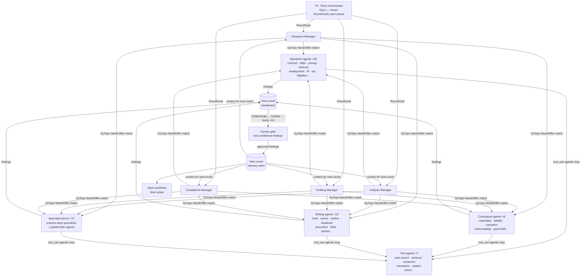
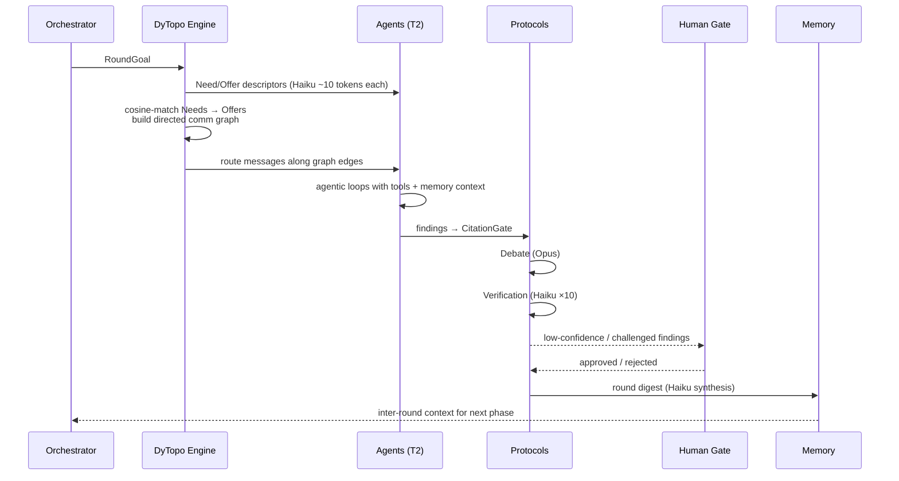

[Docs](../index.md) › Architecture & internals › **Overview**

# Architecture

BigLaw isn't a chatbot with a legal prompt. It's an **orchestration engine**: it runs
*DyTopo rounds* of granular epistemic, conceptual, and writing agents over an **in-process
vector agent registry** — and puts a **debate + verification protocol** between every finding
and the page. Low-confidence or challenged findings stop at a **human gate** before they reach
final synthesis.

## Each DyTopo round

1. Every agent emits a Need/Offer descriptor (Haiku, ~10 tokens)
2. The engine cosine-matches Needs → Offers to build a sparse directed comm graph
3. Messages routed along graph edges to each agent
4. Agents run agentic loops to **retrieve** verbatim passages via hybrid RAG (`search_chunks`), then produce findings through **staged extraction** (see [Grounding & coverage](grounding.md))
5. Findings written to the **intra-round whiteboard**
6. Findings pass **CitationGate → Debate (Opus) → Verification (Haiku ×10)**
7. Haiku synthesises the whiteboard into a round digest → written to **inter-round memory** for the next round
8. Low-confidence / challenged findings escalate to a **human gate** before synthesis

## Q-learning agent recruitment

(`biglaw-go/internal/learning/`)

- A `LearningEngine` maintains a Q-table across `"phase:jurisdiction:workflowType"` states
- High-confidence uncontested findings → reward; challenged findings → penalised ×0.3
- Q-table persisted to `.qtable.json` (override with `LEARNING_FILE`) and reloaded on restart

## Vector storage

Three in-process stores with cosine-similarity search, no external service or native module
required (for a bench this size, brute-force cosine runs in ~1 ms even on ARM64):

| Store | Persistence | Used for |
|---|---|---|
| Agent registry | `./data/agents.json` | Semantic agent recruitment + outcome tracking |
| Inter-round memory | in-memory | Cross-round context retrieval |
| Knowledge base | in-memory | Document chunks + semantic search |

## Project layout

All platform code lives under `biglaw-go/` (module `biglaw-go`, entry point
`biglaw-go/cmd/biglaw`). The retired TypeScript sources are at the `typescript-final` tag.

| Path | Role |
|---|---|
| `biglaw-go/cmd/biglaw/` | Entry point — run modes, firm-wide budget/docket/regulatory monitors |
| `biglaw-go/cmd/topoflow-eval/` | TopoFlow ablation harness (bandit-over-DyTopo evaluation) |
| `internal/orchestrator/` | Task lifecycle, phase sequencing, synthesis, tabulate |
| `internal/dytopo/` | Need/Offer matching, comm graph, two-wave round execution |
| `internal/topoflow/` | AgensFlow bandit over DyTopo topology selection |
| `internal/agents/` | All 131 agent definitions + the agentic-loop base class |
| `internal/agents/registry.go` | In-process vector agent registry — persists to `./data/agents.json` |
| `internal/learning/` | Q-learning recruitment — Q-table persisted to `.qtable.json` |
| `internal/memory/` | Intra-round whiteboard + inter-round vector memory store |
| `internal/knowledge/` | Document knowledge base — chunk ingestion + semantic search |
| `internal/protocols/` | CitationGate · DebateProtocol · VerificationPipeline |
| `internal/tools/` | Tool registry — knowledge retrieval, extraction, docx/tracked-changes/PDF/DocuSeal/tabular document production, Clio, 32 connectors |
| `internal/routing/` | Haiku / Sonnet / Opus / Ollama / local routing |
| `internal/api/` | REST API (gin) — one file per domain route group |
| `internal/mcp/` | MCP stdio server |
| `internal/auth/` | Lawyer profiles, roles, access control + OAuth login, signed sessions, rate limiting |
| `internal/clients/` | Client roster, matter sub-lists, conflict-of-interest checks |
| `internal/timekeeping/` | Billable time tracking — 6-min units, CSV export |
| `internal/billing/` | Pre-bills, LEDES 1998B export/parse, invoice validation |
| `internal/ocg/` | Outside-counsel-guidelines compliance checks |
| `internal/playbook/` | Four-tier playbook cascade — firm/personal/matter/client |
| `internal/citations/` | Citation engine — CourtListener-backed KeyCite replacement |
| `internal/redline/` | Playbook-aware contract redlining |
| `internal/headnotes/` | Headnote extraction from case opinions |
| `internal/precedent/` | Precedent document generation from knowledge store + playbooks |
| `internal/briefing/` | Hub-and-spoke client briefing swarm (Chalkboard pattern) |
| `internal/bots/` | Big Michael — Teams + Slack channel agent |
| `internal/lpm/` | Legal project management — daily status reports, portfolio BLUF, DOCX |
| `internal/clientvoice/` | Remy client-voice advocacy briefs |
| `internal/dockets/` · `internal/regulatory/` · `internal/budget/` | Docket watch, regulatory alerts, matter budget monitors |
| `internal/graph/` · `internal/email/` | Microsoft Graph (SharePoint/Teams) + O365/Gmail search |
| `internal/services/` | Haiku classifiers (practice area, client, NOSLEGAL) + tone analyzer |
| `internal/cost/` | Cost store, cache-aware pricing, watt-hour estimates |
| `internal/deadlines/` | Court deadline engine (rules in `deadlines/rules/*.yaml`) |
| `internal/adapters/` | Plugin adapter — drop JSON in `adapters/external/` for instant integration |
| `internal/secrets/` | Infisical secrets manager (bootstrap from `.env`, rest from vault) |
| `sidecar/` | TypeDB conflict-graph sidecar (Unix-socket IPC) |
| `ui/` | Vite + React console |
| `templates/` · `workflows/` · `agents/lavern/` | Task templates, Lavern workflow + agent configs |

Related: [Grounding & coverage](grounding.md) · [Model routing](model-routing.md) · [The bench's tools](../features/agent-tools.md)
