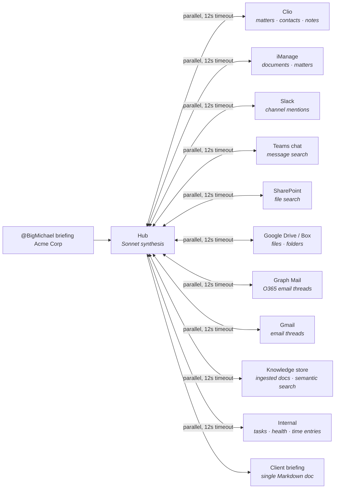

[Docs](../index.md) › Features › **Big Michael**

# Big Michael — the channel agent

**Big Michael** is BigLaw's conversational face in your collaboration tools. Add him to Teams or
Slack and he responds to @-mentions in any channel, dispatching work to BigLaw's bench and
posting results back.

```
@BigMichael status M-2024-001        → matter health score + active tasks + risks
@BigMichael briefing Acme Corp       → full hub-and-spoke client intelligence briefing
@BigMichael search force majeure     → semantic search across the knowledge store
@BigMichael task review this NDA     → submit a roundtable AI task
@BigMichael run due-diligence        → run a named workflow template
@BigMichael help                     → list available commands
```

## Teams setup

(`TEAMS_WEBHOOK_SECRET` + `TEAMS_INCOMING_WEBHOOK_URL`)

1. Teams admin → Apps → Outgoing Webhooks → Create
2. Set callback URL to `https://<host>/bots/teams/webhook`
3. Copy the security token → `TEAMS_WEBHOOK_SECRET`
4. Channel → … → Connectors → Incoming Webhook → copy URL → `TEAMS_INCOMING_WEBHOOK_URL`

## Slack setup

(`SLACK_BOT_TOKEN` + `SLACK_SIGNING_SECRET`)

1. [api.slack.com/apps](https://api.slack.com/apps) → Create App → From scratch
2. Bot Token Scopes: `chat:write`, `channels:history`, `search:read`
3. Event Subscriptions → Request URL: `https://<host>/bots/slack/events`
4. Subscribe to: `app_mention`
5. Install to workspace → copy Bot Token + Signing Secret

## Proactive notifications

When any task completes, Big Michael posts to the matter's linked channel automatically:

```bash
# Link a matter to a Teams channel
POST /bots/teams/matter-link  { "matterNumber": "M-001", "webhookUrl": "https://..." }

# Link a matter to a Slack channel
POST /bots/slack/matter-link  { "matterNumber": "M-001", "channelId": "C0123ABCD" }
```

## Client intelligence briefing

Big Michael's briefing command launches a hub-and-spoke swarm that pulls from all connected
systems in parallel (12 s per spoke, `Promise.allSettled`):



The hub Sonnet synthesises all spokes into a single Markdown briefing. The scattergun problem —
client info spread across 10 mailboxes, 2 call notes, and 4 DM threads — solved in one command.

The briefing is also available over REST: `GET /clients/:id/briefing` (partner only).

Related: [Connectors](../integration/connectors.md) · [REST API](../integration/rest-api.md)
