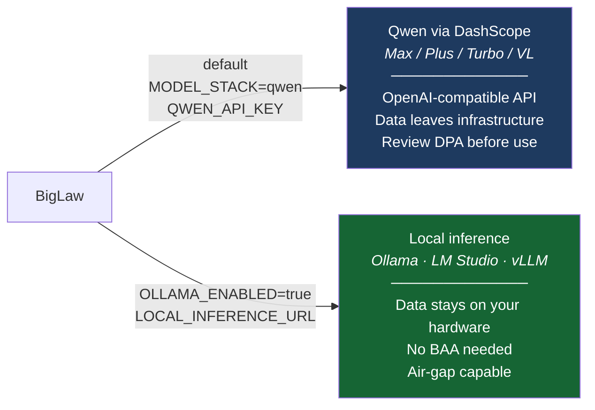

[Docs](index.md) › Get started › **Legal notices & disclaimers**

# Legal Notices and Disclaimers

*Read these. They are not boilerplate. They describe real risks that apply to you.*

## No Legal Advice

**BigLaw does not provide legal advice. Nothing produced by this software — no output, finding,
draft, analysis, summary, headnote, redline, briefing, or synthesis — constitutes legal advice,
and none of it should be relied upon as such.**

BigLaw is a software tool that uses large language models to assist with legal research and
document tasks. LLMs hallucinate. They misstate case holdings. They miss recent developments.
They confuse jurisdictions. They produce authoritative-sounding text that is factually wrong.
The debate and verification protocols in this system reduce these errors but do not eliminate them.

**Every output of this system requires review by a licensed attorney before it is used in any
legal matter.** Relying on unreviewed AI output in client matters may constitute malpractice,
regardless of how capable the underlying system appears.

If you are not a licensed attorney and you are using this software to answer legal questions
about your own situation: please consult a lawyer. This software is not a substitute.

## No Attorney-Client Relationship

Use of BigLaw does not create an attorney-client relationship of any kind — between you and
Discover Legal, between you and any contributor to this project, or between you and any AI
system operated through this software.

> # ⚠ PRIVILEGE IS NOT GUARANTEED
>
> **Whether communications, outputs, or data processed through this system attract
> legal professional privilege (attorney-client privilege, legal advice privilege,
> litigation privilege, or equivalent) depends entirely on your jurisdiction, the
> specific facts of your deployment, how the system is configured, who has access
> to it, and how outputs are used.**
>
> **Do not assume privilege applies. It may not.**
>
> To structure a deployment that maximises privilege protection for your jurisdiction
> — including network isolation, access controls, data residency, and workflow design —
> **engage an independent FDE (Forward Deployed Engineer / Formal Deployment Expert) before handling any privileged matter.**

## Unauthorised Practice of Law

Depending on your jurisdiction, using AI tools to perform certain legal tasks — drafting court
documents, providing legal advice to third parties, representing parties in legal proceedings —
may constitute the unauthorised practice of law if performed by a non-attorney. The fact that
the work is AI-assisted does not change this analysis. Know your jurisdiction's rules.

If you are a law firm deploying BigLaw, you remain responsible for supervising all AI-assisted
work product under your professional responsibility obligations, including the duty of competence
(understanding the technology), the duty of confidentiality (securing client data), and the duty
of supervision (reviewing outputs before they leave the firm).

## Confidentiality and Data Security

**BigLaw processes whatever data you give it.** If you feed it client communications, privileged
documents, personally identifiable information, health records, financial data, or anything else
that is sensitive or regulated, that data will flow through your configured model provider and
may be stored locally. Where that data goes depends entirely on how you have deployed the system.

**BigLaw supports multiple inference backends — the data handling implications differ for each:**

> **Open, free, secure, private — and opinionated about it.** BigLaw concentrates its support and
> compatibility on the projects and vendors that share those values. High-risk, closed vendors that
> make ecosystem-harming moves are actively deprioritized, gated, or hidden — regardless of how
> popular they are. A startup breaker enforces this: the platform will not run against a gated
> vendor's service unless an operator deliberately overrides it.

- **Qwen via DashScope (default)** — the platform default stack (`MODEL_STACK=qwen`). Four tiers
  (`qwen-max`/`qwen-plus`/`qwen-turbo` + vision `qwen-vl-max`) over Alibaba's OpenAI-compatible
  endpoint. Data is sent to DashScope subject to their terms; review before using with client data.
- **Other clouds (GLM, Kimi, OpenAI, DeepSeek …)** — any OpenAI-compatible endpoint via
  `MODEL_STACK`/`PRIMARY_MODEL_URL` (or the `OPENAI_MODEL` shortcut). Data leaves your infrastructure.
- **Ollama / LM Studio / local inference** (`OLLAMA_ENABLED=true` or `LOCAL_INFERENCE_URL`) —
  data never leaves your infrastructure. For air-gapped or maximally confidential deployments,
  local inference is the only option that gives you complete data control. See
  [Local inference](deployment/local-inference.md).

**Regardless of backend, data may also be:**
- Stored in the durable document store — local **SQLite** at `./data/biglaw.db` by default, or
  **Postgres** (`DATABASE_URL`) with database-level row-level security. Vector indexes and
  retained attachment blobs also persist under `./data/`
- Written to the audit log (JSONL, also on disk)
- Included in prompts that are cached by a cloud API provider

**Regulatory obligations depend on your jurisdiction and the nature of the data:**

- **HIPAA (US)** — if you process protected health information, you need a Business Associate
  Agreement (BAA) with your model provider. BAA availability and terms vary by provider and tier,
  and standard API tiers typically do not include BAA coverage. Confirm with your provider before
  processing PHI. If you cannot get a BAA, use local inference.
- **GDPR (EU/EEA)** — processing personal data of EU residents requires a lawful basis and,
  for cloud providers, appropriate Standard Contractual Clauses or equivalent transfer mechanisms.
  Data residency matters. Check where your provider processes and stores data.
- **CCPA / US state privacy laws** — obligations vary by state and the nature of the data.
- **Bar association ethics rules** — most jurisdictions now have guidance on cloud-based legal
  technology. Many require a reasonable investigation of the provider's security and privacy
  practices before using the service with client data.

**The bottom line: your data handling obligations depend on your jurisdiction, your client base,
the sensitivity of the data, and which inference backend you use. There is no universal answer.
Engage qualified legal counsel and an independent FDE to map your specific obligations before
deploying with real client data.**

## Deployment Liability

**You deploy this software at your own risk.** Discover Legal and the contributors to this
project provide it under the Apache-2.0 licence, which explicitly disclaims all warranties,
including fitness for a particular purpose and non-infringement.

Specific risks that arise from misconfigured or insecure deployment include:

- **Client data breach.** If the API is exposed without authentication (`AUTH_ENABLED=false`
  on a network-accessible host), any client matter data ingested into the system is potentially
  accessible to anyone who can reach the endpoint. This would constitute a data breach under
  most applicable law and a serious professional responsibility violation.
- **Credential exposure.** API keys, OAuth tokens, and session secrets stored in `.env` files
  or accessible via a misconfigured server can be extracted and used to incur costs, access
  third-party systems, or impersonate your firm.
- **Prompt injection.** Malicious content in documents you ingest or queries you run through
  the system could potentially manipulate agent outputs. The system includes defences against
  this but they are not complete.
- **Malpractice exposure.** Using AI-generated output without adequate review in a client matter
  creates professional liability risk. This risk is yours, not ours.
- **Regulatory exposure.** Depending on your jurisdiction and practice area, use of AI tools
  in legal matters may trigger disclosure obligations to clients, adverse parties, or courts.
  Some courts require disclosure of AI use in filings. Check your local rules.

## Jurisdiction

This software is designed to support legal work across multiple jurisdictions. It is not
certified, approved, or validated for use in any jurisdiction. The agents, workflows, and
outputs are not a substitute for jurisdiction-specific legal expertise.

## Third-Party Services

BigLaw integrates with numerous third-party services — your chosen model provider, Microsoft
Graph, Google Workspace, Slack, Clio, CourtListener, Westlaw, Everlaw, Ironclad, DocuSign, and others.
Your use of those services through this software is governed by their own terms. BigLaw is
not affiliated with, endorsed by, or a certified partner of any of these services.

## Summary

You are using experimental software in one of the highest-stakes professional contexts that
exists. The software is capable and the engineering is serious. It is also unaudited,
incompletely tested, and built for comprehensiveness first. Use it with appropriate scepticism,
appropriate oversight, and appropriate professional responsibility.

Related: [Security](security.md) · [Access control](operations/access-control.md)
